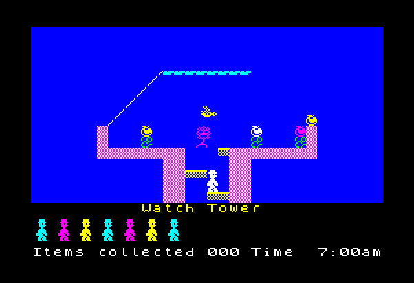
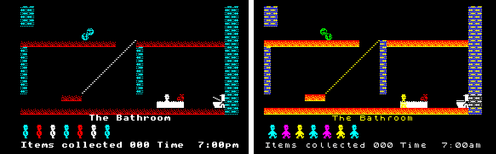
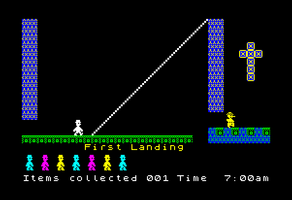

# Jet Set Willy 2021 Edition (BBC Micro)

Similar to my [Manic Miner 2021 Edition](https://github.com/TobyLobster/ManicMiner2021), I set my mind to improving Jet Set Willy on the BBC Micro.
Starting from a [disassembly/reassembly of the original BBC Micro game](https://github.com/TobyLobster/jsw), I made many improvements detailed below.

    jsw.ssd

## Keys

    Z               Left
    X               Right
    RETURN          Jump
    Q               Disable Music
    S               Enable Music
    SHIFT+ESCAPE    Quit current game
    SPACE           Start new game

## Improvements
* More colours on screen.
* More authentic colour choices.
* More tuneful.
* New font.
* Corrected room and sprite definitions.
* Arrows and ropes together again.
* Uses the RETURN key for jump.
* *Watch Tower* crash bug fixed.
* Arrow rendering bug fixed.
* Player start position fixed.
* Works on the Master.

## What I did
It should be noted that the original BBC version written by Dave Mann (using the pseudonym Chris Robson) was a great achievement. Indeed it remains very playable today. The improvements that follow are only made possible by the advent of modern PCs, modern tools, emulators, the combined resources of the Internet, and more time. Nothing here is intended to detract from his efforts.

### We Must Perform Some Filing
Step one is some admin. I created a single source file. The original code/data is split over two files, and code execution flows between them via jump tables. This would have been useful back in the day when memory was tight for developing on the BBC Micro itself. By splitting the source like this you could assemble half of the code as you worked on it and have a chance to fit that source code into memory. In a modern development environment (we have computers with loads of memory) this dichotomy isn't needed, so I put all the code and data together in one file and removed the jump tables. It took some effort to make sure that every detail is labelled correctly, and to remove any assumptions about memory layout in the code so all the code and data can be relocated in memory without causing bugs. Most commonly there were a few places where specific data was assumed to lie on page boundaries. This is usually done for performance benefits with a side benefit of saving a few bytes of memory, but in this case the performance and memory benefit was negligible. The convenience of being able to move, add, remove and change code freely is compelling.

The data had many small pockets of unused memory, so I coalesced all these together into one place. I also moved the memory required for the screen to the end of RAM ($5600 to $7FFF. 32 characters in each row for 21 character rows) so the rest of the game lies contiguously below the screen memory.

### The *Watch Tower* Bug

Enough admin, onto the first bug fix. The original BBC version has a bug where the game crashes as soon as the player enters *Watch Tower*. This bug is present on the [Complete BBC Micro Games archive version](http://www.bbcmicro.co.uk/game.php?id=439)  (maybe disk based?) but not the [Level 7 disassembly](http://www.level7.org.uk/miscellany/jet-set-willy-disassembly.txt) (maybe cassette based?). The reason for the bug is that the code that loads and runs the second file of the game is located exactly where this room definition is supposed to be. The original room definition has now been restored, and the bug is fixed.

### Removing OS Usage
At this point I start to remove all use of the OS. The game uses *OSWRCH* to write text (and more), *OSWORD* for sound, and *OSBYTE* for keyboard, vsync etc. Although I need to write more code to replace these OS routines, it does save memory overall in that the game can use more memory locations if the OS no longer uses them. Use of *OSWRCH* is replaced first, then sound routines are replaced, then keyboard. I use more of zero page for variables, which saves memory for each instance in code that a variable is accessed.

### Interrupts and Palette Changes
The only part of the OS that continues to run (necessarily) is the handling of IRQs. The game uses these interrupts to switch palette colours at each character row down the screen. At each character row in the game area, one palette change can occur. A different palette altogether is switched in for the 'footer' area of the screen. Interrupts are also used for updating the music and sound, and updating timers for the game. But to use this new palette changing facility, I need to be able to edit the room data.

### The Room Data
The rooms are compressed. Each room is encoded as a stream of bits, with different numbers of bits required for each piece of data. This is described in [the Level 7 disassembly](http://www.level7.org.uk/miscellany/jet-set-willy-disassembly.txt). To be able to edit this data, I first needed to decode the existing encoded bytes into an editable text file. I wrote a C# .NET Core console application to do this. The result is 'definitions.txt', a text file describing exactly the information required by the game to show each room. I also include the sprite definitions in this text file too.

The next step was to write a tool that can read 'definitions.txt' and produce an encoded version of it in bytes (as ASM assembly source). This is a second C# .NET Core console application. I took the time to make sure that the resulting bytes were identical to the original bytes. Now every time I assemble the game, I encode the latest data too.

### The Bathroom (Before and After)

The level and sprite data is now editable, so I added new data. Each tile sprite type (i.e. wall, platform, deadly, slope, conveyor, scenery) for a room now has two colours instead of one (the Spectrum calls these two colours PAPER and INK). Platforms in the Bathroom can be red and yellow as per the Spectrum for example, rather than being one single colour always against black.

I also add new data for each room to allow a palette change per character row. e.g. In *The Bathroom*, the enemy at the top of the room moving left and right is now coloured green (as per the Spectrum) by changing a colour of the palette to green for those two rows. Note that each row can still only show at most four colours. This allows for more colours, but still requires some compromises: notice the wall behind the toilet is black and white not yellow and blue.

Now I have these colourful abilities I take a sweep through the whole mansion, painting by numbers. It really brightens the place up. More sweeps happened later where I checked the positions and definitions of the tiles, the initial enemy positions, directions, speeds, and extents. There were many many changes. I also corrected the position and titles of each of the rooms (e.g. correcting *Coservatory Roof* to *Conservatory Roof*) and expanded the compression for room names to accommodate full stops in the room titles, and mid-word capitalisation (e.g. *MegaTree*). All these changes aligned the game closer to the Spectrum version.

I also added the new 'scenery' tile type to help get the room definitions closer to the Spectrum in one or two places.

Another subtle change in *The Bathroom* is that the tile at the top of the central vertical wall has been corrected.

I moved the start position of the player to the correct position (at the end the bath, as per the Spectrum). Willy faces right initially. I've not replicated the Spectrum bug where Willy starts looking left if the previous game ended with willy left. The philosophy here is to not slavishly follow every little quirk of the Spectrum version, but I do use it to guide towards a good Jet Set Willy experience.

We start the game at 7:00am as per the Spectrum (not 7:00pm), working through until 1:00am at a similar rate to the Spectrum.

For reference, here is *The Bathroom* on the Spectrum:

### Border Colour
One feature from the Spectrum that didn't make it into the final game was a border colour. The border helps define the edges of the room giving a more enclosed feel. The BBC Micro has no support for a hardware border colour. Experiments showed it was just about possible to change the palette at the top and bottom of the screen (although there were timing issues since the entire palette needed changing very quickly) but for a border to look good you really need the left and right edges too. This couldn't be done with palette changes so would need bytes written to screen memory. This would limit the border colour to one of the four colours on screen, and would take a lot of extra memory that is in short supply. Reluctantly this feature had to be dropped.

### Arrows
Arrows were missing from rooms with ropes (this was because of a collision issue: ropes would notice something was colliding with it and assumed it was Willy rather than an arrow). I fixed this by making all arrows a different logical colour from Willy and checking specifically for Willy's colour on a rope collision. I then reinstated all arrows from the Spectrum version. I retimed all the arrows as per the Spectrum, and fixed a bug in the rendering of arrows that left a hole in the wall of *A bit of tree*. Arrow sounds are now timed as per the Spectrum to give the player warning of their arrival.

### The Rope
I fixed the swing offsets of the rope to match the Spectrum, and moved *The Beach* rope two character cells left to match the Spectrum. I tweaked the logic to make the player move a little better on the rope. The rope is flicker free.

### Sprites

I added back in this missing happy enemy guard sprite, as found in *Rescuing Esmerelda* and *Above the West Bedroom*.

I also removed several unused tile sprites.

I added some code to reflect enemy sprites from their definitions into the screen ready cache. This means we can store just 4 sprites rather than 8 for some enemies that move left and right (this affects the Monk, Saw, Pig, Bird, and Penguin).

All sprites are now compressed to save memory, and are decompressed at runtime as needed. The compression is nybble based, decompressing one byte at a time:

    0-3     this byte is the same as a byte previously decoded in this sprite (previous byte, previous byte but one, but two, but three)
    4-9     this byte is one of the 6 predetermined most common bytes (stored in a table)
    10-14   The next nybble together with this nybble specifies one of the 80 next most common bytes (stored in a table)
    15      The next two nybbles specify the value of the byte

Thus we save memory on bytes that can be encoded as 0-9, break even on encoding 10-14, and use an extra nybble when encoding 15 is required. Additionally, some sprites don't compress well. We encode these instead as raw bytes (pairs of nybbles), with the first nybble of the sprite encoded as 0 to indicate a raw encoding (since value 0 or any value 0-3 wouldn't otherwise occur at the start of a sprite).

### Enemies
Vertical enemies spin at a medium speed, with the Razor Blade enemies spinning fast. The Monk in the Chapel remains steadfastly looking left (as if possessed?), as per the Spectrum.

### Items
Items twinkle individually, rather than in waves of colour previously. e.g. see *Ballroom West*.

### Lives
The remaining lives are shown by a line of Willy characters walking right. This is unlike the Spectrum where they are static, but apes Manic Miner instead.

### Animated Scenery

I added the feature from the Spectrum that the cross in the *First Landing* flashes, and other places such as *Nomen Luni* other scenery flashes too.

### The Game Over Screen
This uses a standard palette of colours, and flashes the letters of 'GAME OVER' individually.

### The Title Screen

The title screen uses the same palette changing technology as described above to cycle through colours. The scrolling text moves a little smoother now while still retaining the speed (moving four pixels at a time instead of eight). The scrolling text is tidied up slightly (the game is 'Jet Set Willy' not 'Jetset Willy', and I switched to 'BBC Micro' not 'BBC micro'). The *Moonlight Sonata* plays, with less screech than the Spectrum.

### Spectrum Font
The spectrum font was added and used throughout. Prior to this point I was reading the OS definitions for the characters from ROM and this needed Master specific code. In the end I found enough space to encode the characters we need from the Spectrum font, which feels nicer. The font sprites are compressed in the same way as all the other sprites.

### Music
I have updated the in game tune *If I Were A Rich Man* to be longer, more accurate, and gentler on the ears. *Moonlight Sonata* now plays on the title screen.

### Documenting the Remaining Minor Differences

* The jump parabola shape is very slightly different (while still being the same height and length overall) since the code seems to have problems with odd numbers of pixel height changes within the jump. This makes only a few minor changes overall:
    - *Nomen Luni*: On the BBC you can jump from the top of the slope, under the Moon enemy to land on the platform under the ledge. On the Spectrum you have to jump to the lower platform first.
    - *The Bow*: to jump up from the platform next to the wheel item needs two platform tiles instead of just one.
    - *Top Landing*: Jumping into the Chapel area lands on the top level of flooring not the tiles below as on the Spectrum.
* *The Forgotten Abbey*: The platform under the item should be a wall, but changing this means the player can't fall down past it, trapping them at the top of the room.
* *The Chapel*: The player can't jump through the slope.
* *To the Kitchens  Main Stairway*: The lower pastille enemy should be a bird, but that's too many different enemy sprites to fit in the cache. This would require 512 bytes more memory!
* *The Forgotten Abbey*: Is missing an enemy on the middle platform, but the code is only set up to handle 0-7 enemies in a room, and this would be the eighth.
* The extents of vertical enemies is specified per pixel on the Spectrum, but only per cell on the BBC, so they can be a few pixels out occasionally.

### Final Thoughts
This was a much bigger undertaking than Manic Miner since there are 3 times as many rooms as there were caverns, but I am very pleased with the final result. The look of the mansion is greatly enhanced and the extra features like having more music and a new font make the game feel more polished. The cumulative effect of all the smaller fixes I believe add up to make the game feel like a more authentic Jet Set Willy experience as a whole.

## Thanks
* Thanks to Graham Nelson for suggesting various good ideas, including the palette swapping trick and sprite compression scheme.

*  http://www.level7.org.uk/miscellany/jet-set-willy-disassembly.txt
An excellent disassembly for understanding the BBC Micro version. This was the starting point.

* https://skoolkit.ca/disassemblies/jet_set_willy/hex/
The definitive place for discovering exactly how the original Spectrum game works.

* http://mdfs.net/Software/JSW/BBC/
More BBC Micro disassemblies, including patched versions of JSW and JSW 2.
